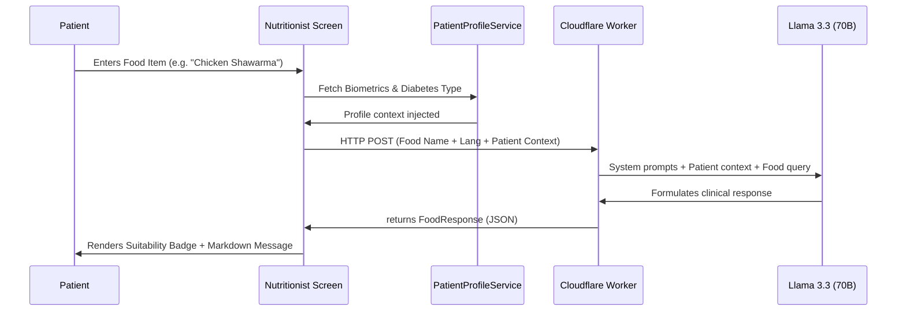

# Nutritionist Agent

An AI-driven diabetic nutrition assistant powered by Large Language Models (LLM) and structured clinical databases. It evaluates the suitability of individual food items for diabetic patients, returns detailed nutritional analysis, and provides direct clinical action triggers.

---

## 🤖 Architecture & Clinical Workflows

### 1. LLM-Based Personalization Pipeline
The agent runs an on-demand clinical evaluation utilizing patient context:

### 2. Clinical Evaluation Guidelines
The AI assesses food suitability based on established international guidelines (ADA 2024, WHO, USDA, University of Sydney):
* **Glycemic Index (GI)**: High-GI foods (e.g. white rice, sugary beverages) are flagged as unsuitable or require portion constraints.
* **Carbohydrate & Sugar Density**: Calculations evaluate impact on postprandial glucose levels.
* **Sodium & Lipids**: Saturated fat and high sodium contents are flagged to manage cardiovascular risks.
* **Bilingual Support**: Auto-detects English vs. Arabic queries and replies in the patient's language.

---

## 🛠️ Code Structure

* [nutritionist_service.dart](file:///d:/sms.doc/models-code/02_nutrition%20agent/nutritionist_service.dart): Manages the API gateway to the Cloudflare worker proxy.
* [models/food_response_model.dart](file:///d:/sms.doc/models-code/02_nutrition%20agent/models/food_response_model.dart): Data model specifying the structure of the agent's response.
* [nutritionist_agent_page.dart](file:///d:/sms.doc/models-code/02_nutrition%20agent/nutritionist_agent_page.dart): A premium, conversational chat interface with gradient buttons, auto-scroll transitions, and info sheets.

---

## 🚀 Action Triggers & Integration

The agent returns conversational text along with functional action triggers rendered at the bottom of each response:
1. **Add to Plan**: Calls the parent's `onAddToDiet` callback to insert the assessed food (at the designated grams) directly into the patient's daily diet planner.
2. **Save Log**: Saves the entry locally into the patient's snack log history.
3. **Ask Doctor**: Automatically redirects the patient to secure message logs with their physician for further clinical review of the food item.
