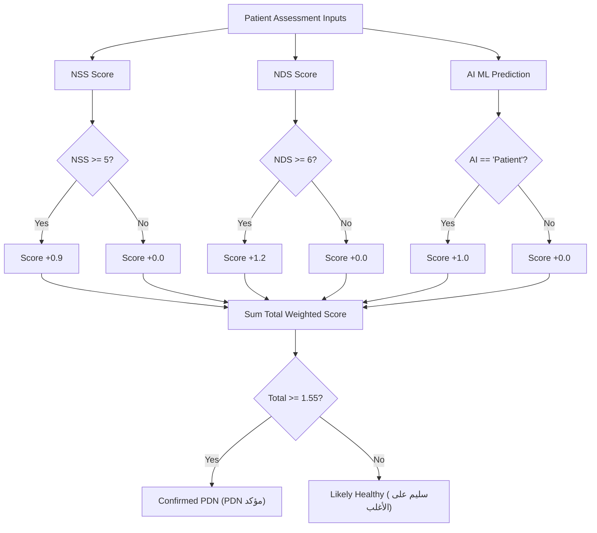

# Diabetic Neuropathy Assessment

A comprehensive clinical assessment and predictive diagnostic module for Painful Diabetic Neuropathy (PDN). It combines patient-reported symptoms (NSS), physical examination scores (NDS), and a machine learning classifier using a weighted decision model to provide a robust clinical verdict.

---

## 🩺 Clinical Scoring Systems

### 1. NSS (Neuropathy Symptom Score)
The NSS is a patient-completed symptom checklist evaluating six core neuropathic sensory disturbances:
* **Symptoms Evaluated**:
  1. Burning pain (ألم حارق)
  2. Numbness (تنميل)
  3. Tingling (وخز بالإبر)
  4. Fatigue or heaviness in feet (تعب/ثقل في القدم)
  5. Paresthesia (إحساس غير طبيعي مثل نمل يجري)
  6. Allodynia - pain on light touch (ألم عند لمس شيء خفيف)
* **Scoring Rules**:
  * For each symptom present: **+1 point**
  * If the symptom worsens at night: **+1 point**
  * If the symptom is severe: **+1 point**
  * *Maximum NSS Score*: **14**
* **Severity Classification**:
  * **Normal (طبيعي)**: $\le 2$
  * **Mild (خفيف)**: $3 - 4$
  * **Moderate (متوسط)**: $5 - 6$
  * **Severe (شديد)**: $7 - 14$

---

### 2. NDS (Neuropathy Disability Score)
The NDS is a physician-administered sensory impairment exam. It checks five modalities on both feet (recording the worse score between left and right):
1. **Vibration Sensation (شوكة رنانة / اهتزاز)**: Checked at the big toe and ankle.
   * *Normal* ($\le 2$ seconds): **0 points**
   * *Weak* ($3 - 5$ seconds): **2 points**
   * *Delayed* ($6 - 10$ seconds): **3 points**
   * *Absent* ($>10$ seconds): **6 points**
2. **Temperature Sensation (حرارة / برودة)**: Checked using warm and cold water trials across left and right feet. Score is based on absolute difference from standard skin temperature ($37^\circ\text{C}$):
   * *Normal* ($\Delta T \le 2^\circ\text{C}$): **0 points**
   * *Mild deficit* ($\Delta T \le 5^\circ\text{C}$): **2 points**
   * *Moderate deficit* ($\Delta T \le 8^\circ\text{C}$): **3 points**
   * *Severe deficit* ($\Delta T > 8^\circ\text{C}$): **5 points**
3. **Pain Sensation (ألم / وخز دبوس)**: Tested using pinprick at 5 points.
   * *Normal*: **0 points**
   * *Weak pain*: **2 points**
   * *Touch only (no pain felt)*: **4 points**
   * *No sensation*: **6 points**
4. **Light Touch (لمس خفيف)**: Tested using cotton/tissue touch.
   * *Normal*: **0 points**
   * *Weak*: **1 point**
   * *Intermittent*: **2 points**
   * *Absent*: **3 points**
5. **Functional Reflexes (منعكس القدم)**: Tested via standing on tiptoes and heel walking.
   * *Normal*: **0 points**
   * *Minor difficulty*: **1 point**
   * *Clear difficulty*: **2 points**
   * *Unable*: **3 points**

* *Maximum NDS Score*: **23**
* **Severity Classification**:
  * **Normal (طبيعي)**: $\le 5$
  * **Mild (خفيف)**: $6 - 10$
  * **Moderate (متوسط)**: $11 - 16$
  * **Severe (شديد)**: $17 - 23$

---

## 🤖 Machine Learning Pipeline (Random Forest)

The feature includes a Random Forest Classifier trained on clinical patient data:
* **Target Label**: `Neuropathy` (Binary)
* **Model Inputs (Features)**:
  * Baseline metrics: `NSS`, `BMI baseline`, `Age baseline`, `HbA1c baseline`
  * Sensory indicators: `heat right`, `heat left`, `cold right`, `cold left`
* **Feature Engineering**:
  * `heat_avg` = Average of right and left heat sensory threshold
  * `cold_avg` = Average of right and left cold sensory threshold
  * `BMI_Age` = Ratio of baseline BMI to baseline Age
* **Training & Resampling**:
  * Utilizes **SMOTE** (Synthetic Minority Over-sampling Technique) to address class imbalance.
  * Standardizes inputs using `StandardScaler`.
  * Optimizes hyperparameters via `GridSearchCV` (`n_estimators`, `max_depth`, `min_samples_split`, `min_samples_leaf`).
  * Yields $\ge 90\%$ test accuracy on clinical benchmarks.

---

## ⚖️ Weighted Final Decision Engine

To achieve maximum diagnostic accuracy, the model integrates clinical scores and machine learning predictions into a weighted voting model:

### Weight Distribution:
* **NDS Score ($\ge 6$)**: Weight $1.2$ *(highest clinical weight due to objective physical signs)*
* **AI Prediction (Neuropathy)**: Weight $1.0$ *(ML model probability)*
* **NSS Score ($\ge 5$)**: Weight $0.9$ *(clinical weight for patient-reported symptoms)*

$$\text{Total Score} = (\text{AI}_{\text{binary}} \times 1.0) + (\text{NDS}_{\text{binary}} \times 1.2) + (\text{NSS}_{\text{binary}} \times 0.9)$$

### Decision Threshold:
* **Threshold**: **$1.55$** (equal to half of the total weight sum: $\frac{1.0 + 1.2 + 0.9}{2}$)
* **Verdict**:
  * $\text{Score} \ge 1.55$ $\rightarrow$ **Confirmed PDN (PDN مؤكد)**
  * $\text{Score} < 1.55$ $\rightarrow$ **Likely Healthy (سليم على الأغلب)**

---

## 📂 Source Notebooks
1. **`NSS.ipynb`**: Interactive questionnaire tool for patient-reported symptoms.
2. **`NDS(1).ipynb`**: Diagnostic test suite measuring physical sensory and motor reflex degradation.
3. **`diabetic neuropathy(90)code.ipynb`**: Machine learning model training script (Random Forest Classifier).
4. **`final_decision.ipynb`**: Integrated scoring engine demonstrating the weighted decision model.
