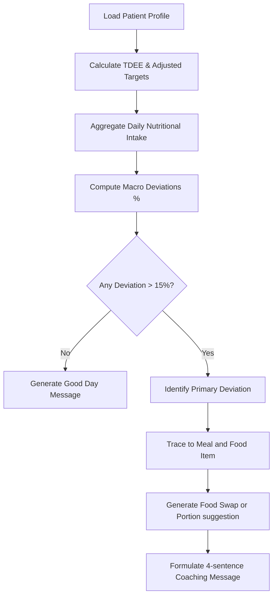

# Daily Nutrition Coach

An automated, clinically-driven nutrition analysis and coaching module. It calculates personalized macronutrient targets based on user biometric data, evaluates actual intake from logged meals, traces significant deviations, and generates patient-facing recommendations.

---

## 🩺 Clinical Logic & Pipelines

The coaching logic follows an 8-step pipeline:



### 1. Targets Calculation
Macronutrient targets are established dynamically using:
* **BMI**: Calculated to categorise status (underweight, normal, overweight).
* **TDEE**: Calculated using the **Mifflin-St Jeor** BMR equation adjusted by physical activity level.
* **Goal Adjustment**: Targets are adjusted if weight loss (TDEE - 500 kcal) or weight gain (TDEE + 500 kcal) is appropriate.
* **Macro Split (ADA & Clinical Guidelines)**:
  * **Carbohydrates**: $45\%$ of energy intake ($4\text{ kcal/g}$).
  * **Protein**: $20\%$ of energy intake ($4\text{ kcal/g}$).
  * **Fat**: $35\%$ of energy intake ($9\text{ kcal/g}$).

### 2. Deviation Thresholds & Meal Tracing
* **Deviation**: Triggered if actual consumption is off target by more than $\pm 15\%$.
* **Primary Deviation**: The macro with the largest absolute percentage deviation from its target.
* **Meal Tracing**: Identifies the specific meal (Breakfast, Lunch, Dinner, Snacks) and the highest-contributing food item responsible for the deviation.

### 3. Smart Swap & Portion Recommendation
The coach suggests an actionable improvement for the next day:
* **Familiar Swap**: Scans the patient's 30-day eating history to find a previously logged food that is lower in the target macro.
* **Portion Control**: If no familiar alternative is found, it falls back to suggesting a $1/3$ portion size reduction of the offending food.

### 4. Patient Message Generation
The service composes a friendly, concise, 4-sentence coaching narrative structured as follows:
1. **Sentence 1 (Positive Note)**: Praises a macro target that was successfully met, or acknowledges logging consistency.
2. **Sentence 2 (Clinical Insight)**: Summarizes the primary deviation, actual vs. target value, percentage deviation, and traces it to the specific meal and food.
3. **Sentence 3 (Actionable Swap/Portion Advice)**: Proposes tomorrow's food swap or portion adjustment.
4. **Sentence 4 (Encouragement)**: Closes with supportive coaching.

---

## 🛠️ Code Structure

- [daily_nutrition_coach_service.dart](file:///d:/sms.doc/models-code/daily_coach/daily_nutrition_coach_service.dart): Core engine running the coaching evaluation pipeline.
- [daily_nutrition_coach_page.dart](file:///d:/sms.doc/models-code/daily_coach/daily_nutrition_coach_page.dart): A Flutter dashboard card displaying:
  - Narrative coaching message.
  - Linear progress indicators for target vs. actual macro consumption.
  - Interactive details on primary deviations and suggested food swaps.
- [daily_nutrition_coach_test.dart](file:///d:/sms.doc/models-code/daily_coach/daily_nutrition_coach_test.dart): Unit tests covering empty logs, perfect day coaching, macro deviations, and tracing logic.

---

## 🚀 How to Integrate

1. **Required Stubs**:
   This module integrates with the following shared app services (which can be mock-implemented as in the tests):
   - [daily_log.dart](file:///d:/sms.doc/models-code/patient/diseases/diet_plan/models/daily_log.dart)
   - [meal_entry.dart](file:///d:/sms.doc/models-code/patient/diseases/diet_plan/models/meal_entry.dart)
   - [diet_calculator.dart](file:///d:/sms.doc/models-code/patient/diseases/diet_plan/services/diet_calculator.dart)
   - [patient_profile_service.dart](file:///d:/sms.doc/models-code/services/patient_profile_service.dart)
   - [diet_storage_service.dart](file:///d:/sms.doc/models-code/patient/diseases/diet_plan/services/diet_storage_service.dart)

2. **Displaying the Page**:
   Simply navigate to or include the `DailyNutritionCoachPage` in your diet or dashboard tabs:
   ```dart
   const DailyNutritionCoachPage()
   ```

---

## 🧪 Verification

To run unit tests:
```bash
dart run daily_coach/daily_nutrition_coach_test.dart
```
